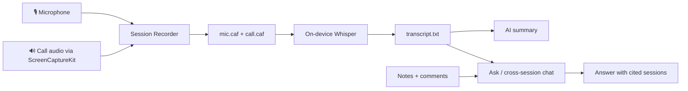
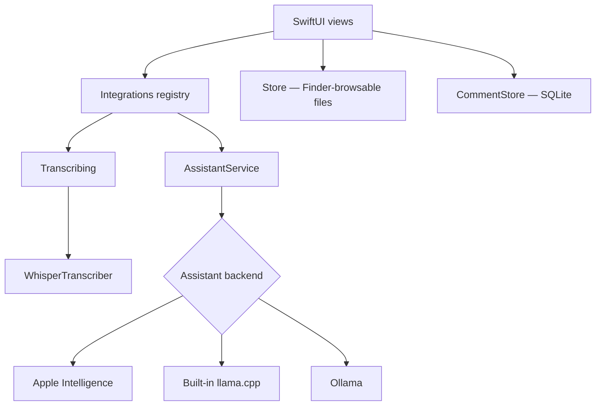
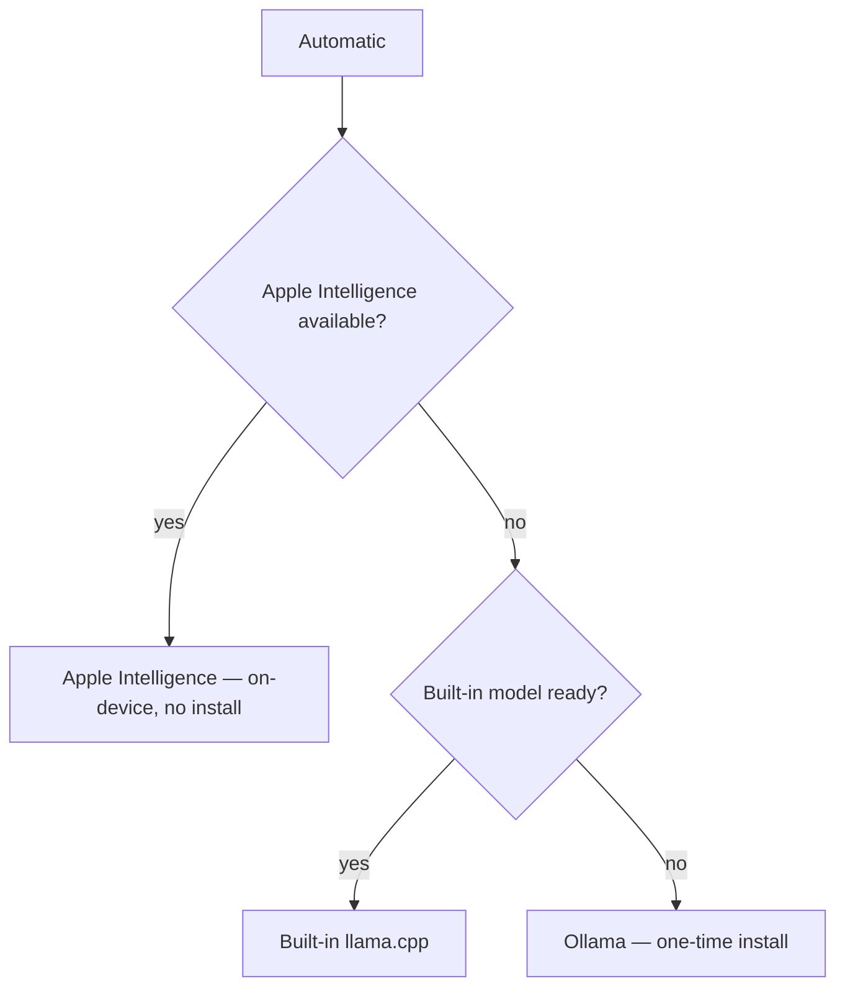
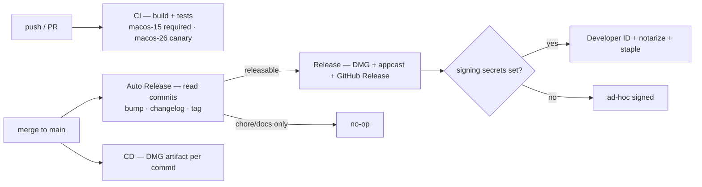

# Aletheia — private therapy session notes

A local-only macOS app for a therapist to record, transcribe, and summarize
browser-based video therapy sessions, then search, annotate, and ask questions
across a patient's history. **Privacy is the whole point:** session audio is
PHI, so nothing ever leaves the Mac it runs on.

📖 [Setup guide](docs/SETUP-GUIDE.md) · ⚖️ [Consent note](CONSENT.md) · 🔒 [Security](SECURITY.md) · 📝 [Changelog](CHANGELOG.md) · 📄 [License](LICENSE) · 📃 [Terms](TERMS.md) · 🔏 [Privacy](PRIVACY.md)

> **License:** source-available but **not** open source — all rights reserved. The code is public for transparency and evaluation; running or reusing it needs written permission. See [LICENSE](LICENSE).

## What it does

- 🎙 **Record** the therapist's mic and the call's audio as two tracks — no
  virtual audio driver.
- ✍️ **Transcribe** on-device (Whisper), speaker-labeled, then **summarize**
  with a local LLM.
- 🔎 **Search** across every patient and session; **export** a session or a
  whole history to Markdown.
- 💬 **Ask across sessions** — chat grounded in the transcripts, with the
  session date cited as its source.
- 🗒 **Notes & comments** — freeform per-session notes and inline transcript
  comments the AI chat takes into account.
- 🔔 **Fits the Mac** — Spotlight, Siri/Shortcuts, Reminders, Calendar,
  notifications, and an in-app updater.

## How a session flows



## Why native Swift/SwiftUI

An earlier draft shelled out to `ffmpeg`/`whisper-cli`/`ollama` from a
Python/Tkinter wrapper. This is a ground-up native rewrite so the app can be a
**real sandboxed macOS app** — App Sandbox + Hardened Runtime on — which is
possible only because it never spawns an external process:

- **Transcription in-process** via [SwiftWhisper](https://github.com/exPHAT/SwiftWhisper)
  (whisper.cpp), not a CLI.
- **Call audio via ScreenCaptureKit** in audio-only mode — one system
  permission, no BlackHole/virtual driver.
- **Local LLM** reached in-process or over `127.0.0.1`, never by spawning a
  binary.

Distribution is ad-hoc signed by default (no Apple Developer account), so the
first launch needs a right-click → Open — see the setup guide. Tagged releases
can be Developer ID-signed and notarized (below).

## Architecture



Every external integration sits behind a protocol in `Services/Integrations/`,
so a backend swaps without touching the UI. The one registry (`Integrations`)
decides which concrete type backs each adapter.

**Storage is deliberately plain and Finder-browsable** — one folder the user
picks (defaults inside iCloud Drive, so backup is automatic), reached across
launches via a security-scoped bookmark:

```
<dataRoot>/
  SessionNotes.sqlite          # therapist's notes + inline comments (PHI, local)
  Patients/<Patient-Slug>/
    patient.json
    patient_chat.json
    YYYY-MM-DD_Session/
      mic.caf / call.caf        # two audio tracks
      transcript.txt            # merged, timestamped, speaker-labeled
      summary.txt
      chat.json
```

Everything except the annotations DB is plain JSON/text a non-technical user
can read. The one database is SQLite living *inside* that same folder, so it
backs up with everything else and never leaves the Mac.

## AI backend (tiered, on-device first)

The backend is chosen to keep setup as close to zero-install as the hardware
allows; the user can override it in Settings.



Only official/first-party runtimes are used (no third-party LLM wrappers).
Apple Intelligence and the llama.cpp binding compile in behind
`#if canImport(...)`, so they light up on a supporting Mac/toolchain and
compile out otherwise.

> **Apple Intelligence is currently disabled** (`Integrations.appleIntelligenceBlocked`).
> As Apple moves system intelligence toward a cloud (Gemini) backhaul, Aletheia
> sticks to backends it can prove stay on this Mac — Ollama and the built-in
> llama.cpp. `Automatic` therefore resolves to a local backend. Flip the flag to
> re-enable the on-device Foundation Models path.

<details>
<summary>Bringing up the embedded llama.cpp backend (Mac, one-time)</summary>

The binding lives behind `#if canImport(llama)` and compiles out until the
package is linked, so CI stays green without building the heavy C++.

1. In `SessionNotes/project.yml`, uncomment the `llama` package stanza and the
   `- package: llama` dependency, and pin `revision:` to a **verified
   `ggml-org/llama.cpp` commit SHA** (don't track a branch).
2. `./scripts/build.sh` — `LlamaAssistant` now compiles and Settings shows a
   "Built-in Model" section to download a GGUF.
3. Verify `LlamaAssistant`'s `llama.h` calls against that pinned revision — the
   symbols weren't compiler-checked in CI.
4. Confirm the model download URLs and add a SHA-256 integrity check before
   shipping it enabled.
</details>

## Build · Test · Release

Requires a Mac with Xcode 16+. The project is generated from
`SessionNotes/project.yml` (XcodeGen) rather than a checked-in `.xcodeproj`.

```bash
./scripts/build.sh          # ad-hoc signed app in dist/
cd SessionNotes && xcodegen generate && xcodebuild test -scheme SessionNotes -destination 'platform=macOS'
```

CI/CD runs entirely on GitHub Actions with **only first-party actions plus
Apple/Homebrew CLIs** — no third-party marketplace actions:



Unit/integration tests cover the platform-independent logic (storage, search,
retrieval/citations, prompt building, annotations) against a temp directory;
audio/transcription/LLM round-trips need a hands-on pass on a real Mac.
Signing & notarization are optional and secret-gated (see
`.github/workflows/release.yml` for the exact secret names).

### Releasing

Releases are **automated from [Conventional Commits](https://www.conventionalcommits.org/)** —
no manual version bumping. On every merge to `main`, the `Auto Release` workflow
reads the commits since the last `v*` tag and decides the bump:

| Commit type | Example | Result |
| --- | --- | --- |
| `feat!:` / `BREAKING CHANGE:` | `feat!: drop macOS 13` | **major** (`1.4.2 → 2.0.0`) |
| `feat:` | `feat: streaming chat` | **minor** (`1.4.2 → 1.5.0`) |
| `fix:` / `perf:` / `revert:` | `fix: crash on empty note` | **patch** (`1.4.2 → 1.4.3`) |
| `chore:` / `docs:` / `test:` / … | `docs: tweak README` | **no release** |

When a bump is warranted it **generates the `CHANGELOG.md` section from the
commit subjects** since the last tag (grouped into Added/Fixed/Changed), sets the
app version in `Info.plist`, tags `main` HEAD, and hands off to `release.yml` to
build the DMG, generate the updater's `appcast.json`, and publish the GitHub
Release. Merges with only chore/docs commits are a quiet no-op, so routine work
doesn't cut versions. **Don't hand-edit `CHANGELOG.md` in a PR** — it's produced
at release time, so editing it just creates merge conflicts.

The bump is read from **commit subjects on `main`**, so the merge commits need to
carry the convention: use **squash-merge with the PR title as the subject** (e.g.
`feat: streaming chat`) rather than the default `Merge pull request #NN …`, which
is never releasable. A merge whose commits don't match any rule is a no-op.

Releases also require a **source or config change**: a merge that touches only
markdown, `docs/`, or test files never rebuilds, even with a `feat:`/`fix:`
subject. (A later code change still ships those docs along with it.) A manual
dispatch overrides this.

**Cut a release by hand** (e.g. to force a level, for the first tag, or when the
commit subjects weren't conventional) from the Actions tab → **Auto Release** →
**Run workflow**: pick a bump level, or enable **dry run** to preview the
computed version without tagging. To skip the automation entirely, pushing a
`v*` tag yourself still triggers `release.yml` directly.

## Known limitations

- **Runtime paths need manual verification.** CI compiles the app and runs the
  logic tests, but microphone/screen-audio capture, on-device Whisper, and LLM
  round-trips need a real Mac.
- **Mic/call sync isn't sample-accurate** — the two tracks start a few ms apart;
  fine for who-said-what, not frame-accurate lip sync.
- **CPU/Metal inference, no bundled CoreML encoder** — larger Whisper models are
  slower on an Air; the default (Small) is chosen for that.
