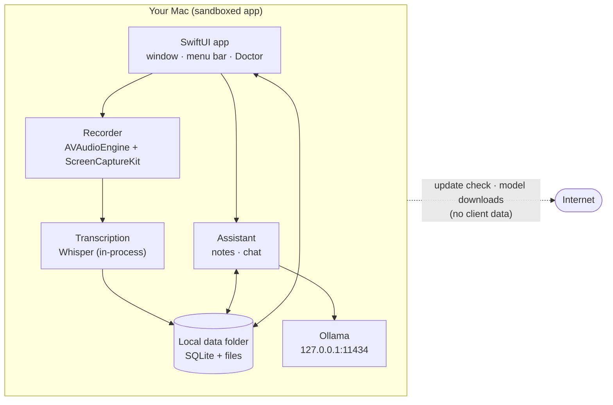
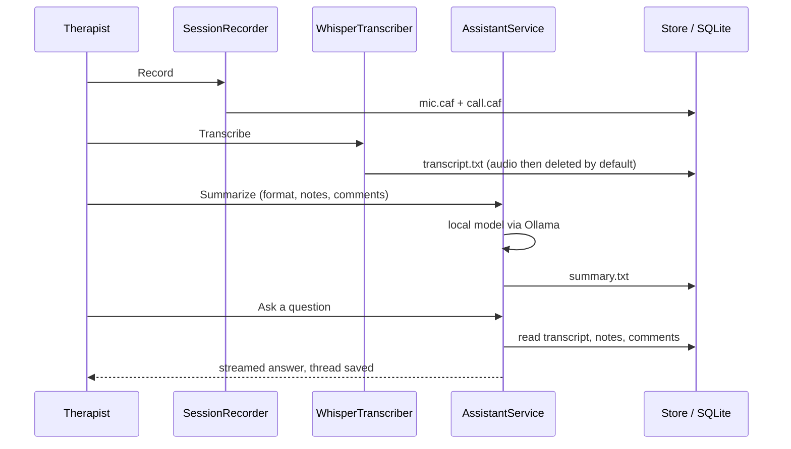
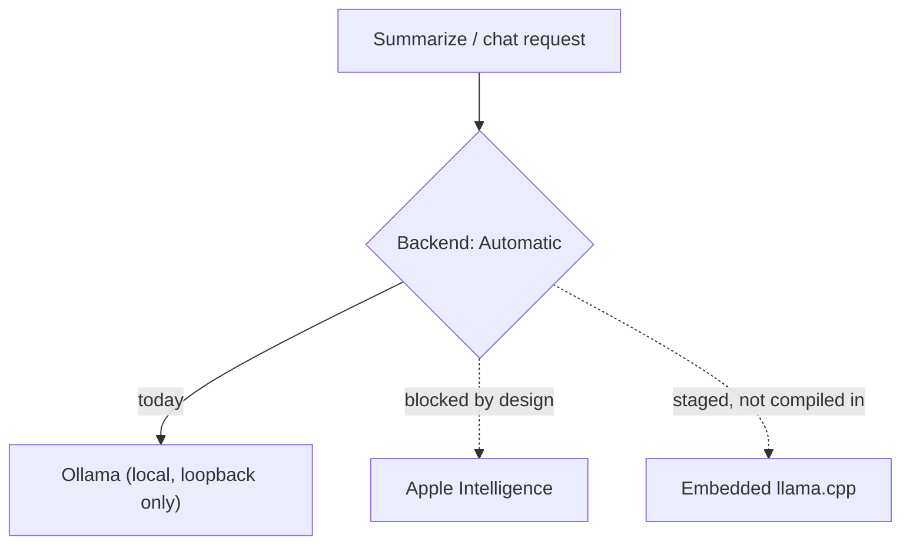
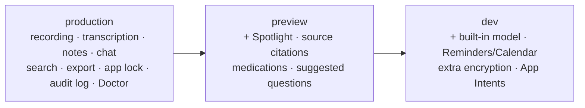
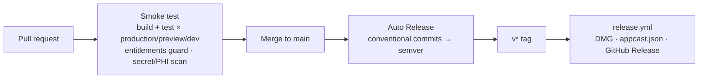

# Aletheia

**Session notes for therapists, written on your Mac and kept on your Mac.**

Aletheia records a video-call therapy session, transcribes it, drafts a progress note, and lets you search and ask questions across a client's history. The speech recognition and the AI both run on your computer. Client data is never sent to a server, and there is no analytics or telemetry.

[Quickstart](#quickstart) · [How it works](#how-it-works) · [Developer quickstart](#developer-quickstart) · [Setup guide](docs/SETUP-GUIDE.md) · [Security](SECURITY.md) · [Changelog](CHANGELOG.md)

> **License:** source-available, not open source. All rights reserved; see [LICENSE](LICENSE), [Terms](TERMS.md) and [Privacy](PRIVACY.md).

---

## What it does

| | |
|---|---|
| **Record** | Your microphone and the other side of the call, captured as two separate tracks. No virtual audio driver. Start and stop from the window or the menu bar. |
| **Transcribe** | On-device Whisper. Lines are labeled "Therapist" and "Call audio" and merged by timestamp. |
| **Write the note** | A draft progress note from the transcript, your notes and your comments: narrative (default), SOAP, DAP, BIRP or GIRP. |
| **Annotate** | Free-form session notes and inline comments on specific transcript lines. |
| **Ask** | Chat about one session, or about all of a client's sessions together. |
| **Search** | Full-text search across clients and sessions. |
| **Export** | A session or a client's full history as Markdown. |
| **Protect** | Optional app lock (Touch ID or password) with idle auto-lock, a PHI-free audit log, and an in-app health check (Aletheia Doctor). |

### Privacy, stated precisely

- No client content leaves the Mac. Recording, transcription, summarizing and chat are all local.
- The app does make a few requests that carry no client data: a check for new versions (a plain download of a small file from GitHub), and downloads of the speech and AI models you choose to install.
- The app runs in the macOS App Sandbox, spawns no subprocesses, and its only network entitlement is outbound client connections.
- Raw audio is deleted after transcription unless you opt in to keeping it and encryption is on.
- Apple Intelligence is deliberately disabled so every AI path is provably on-device.
- The app does not make its own backup copies yet. Time Machine includes the data folder by default. See [docs/DATA-SAFETY.md](docs/DATA-SAFETY.md).

Aletheia is a tool, not legal or clinical advice. Read [CONSENT.md](CONSENT.md) before recording anyone.

---

## Quickstart

You need a Mac running **macOS 14 or newer**. Apple Silicon with 16 GB of memory gives the best results; 8 GB works with smaller models.

### 1. Get the app

Download the latest `Aletheia-<version>.dmg` from the [Releases page](https://github.com/mgwedd/aletheia/releases), open it, and drag **Aletheia** into **Applications**.

### 2. Open it the first time

The app is not yet notarized by Apple, so macOS will hesitate. In **Applications**, **right-click Aletheia and choose Open**, then confirm. You only do this once.

### 3. Follow the setup screen

On first launch Aletheia walks you through a checklist:

1. **Choose a folder for your data.** Everything lives here. If you use iCloud Drive, the picker starts there; any folder works.
2. **Allow the microphone.**
3. **Allow Screen Recording.** macOS calls it that, but Aletheia only uses it to hear the audio of your video call. It does not capture the screen.
4. **Download the speech model.** The app picks a size suited to your Mac.
5. **Install Ollama and download an AI model.** [Ollama](https://ollama.com) is a free app that runs the AI on your Mac. Aletheia links you to it and starts it for you.
6. **Accept the Terms and Privacy notice.**

Downloads are a few hundred megabytes to several gigabytes and happen once.

### 4. Your first session

1. Add a client from the client list.
2. Open your video call as usual, then press **Record** in Aletheia (or use the menu bar icon).
3. Press **Stop** when finished. Choose **Transcribe**, then **Summarize** to draft the note.
4. Edit the note, add comments, and use **Ask** for questions about the session.

For step-by-step help and troubleshooting, see the [Setup guide](docs/SETUP-GUIDE.md). If something looks wrong, open **Help → Aletheia Doctor** for a health report that contains no client information.

---

## How it works

### System overview


```mermaid
flowchart LR
  subgraph Mac["Your Mac (sandboxed app)"]
    UI["SwiftUI app<br/>window · menu bar · Doctor"]
    REC["Recorder<br/>AVAudioEngine + ScreenCaptureKit"]
    STT["Transcription<br/>Whisper (in-process)"]
    AI["Assistant<br/>notes · chat"]
    DB[("Local data folder<br/>SQLite + files")]
    LLM["Ollama<br/>127.0.0.1:11434"]
    UI --> REC --> STT --> DB
    UI --> AI --> LLM
    AI <--> DB
    UI <--> DB
  end
  NET(["Internet"])
  Mac -. "update check · model downloads<br/>(no client data)" .-> NET
```

### A session, end to end


```mermaid
sequenceDiagram
  participant T as Therapist
  participant R as SessionRecorder
  participant W as WhisperTranscriber
  participant A as AssistantService
  participant S as Store / SQLite
  T->>R: Record
  R->>S: mic.caf + call.caf
  T->>W: Transcribe
  W->>S: transcript.txt (audio then deleted by default)
  T->>A: Summarize (format, notes, comments)
  A->>A: local model via Ollama
  A->>S: summary.txt
  T->>A: Ask a question
  A->>S: read transcript, notes, comments
  A-->>T: streamed answer, thread saved
```

### Where data lives

```
<data folder>/
  .aletheia.json                  schema version stamp
  Aletheia.sqlite                 notes, comments and chat threads
  audit.log                       PHI-free event log
  .aletheia-keystore.json         only when encryption is on
  .backups/{migrations,snapshots,archives}/
  Patients/<Patient-Slug>/
    patient.json
    YYYY-MM-DD_Session/
      session.json  mic.caf  call.caf  transcript.txt  summary.txt
```

Schema changes are append-only migrations, and a pre-migration copy of the database is written to `.backups/migrations` before each one runs. The SQLite file is a single `records` table of `(kind, id, owner, item, payload)`; the patient and session layer sits on top of that store.

### AI backends


```mermaid
flowchart TD
  Q["Summarize / chat request"] --> R{"Backend: Automatic"}
  R -->|today| O["Ollama (local, loopback only)"]
  R -.->|blocked by design| AI["Apple Intelligence"]
  R -.->|staged, not compiled in| L["Embedded llama.cpp"]
```

- **Ollama** is the runtime in use. The app talks to it on `127.0.0.1` only.
- **Embedded llama.cpp** has a complete engine in the source, behind `canImport(llama)`, but the package is not linked in shipping builds. Bring-up steps are in [Bringing up llama.cpp](#bringing-up-embedded-llamacpp).
- **Apple Intelligence** is disabled via `Integrations.appleIntelligenceBlocked = true`.

Default model sizes are chosen from your hardware:

| Mac | Speech model | AI model |
|---|---|---|
| Apple Silicon, 16 GB+ | medium.en | llama3.1:8b |
| Apple Silicon, 8 GB+ | small.en | llama3.2:3b |
| Intel, 16 GB+ | small.en | llama3.1:8b |
| Other, 8 GB+ | base.en | llama3.2:3b |
| Under 8 GB | base.en | llama3.2:1b |

### Build tiers

Features are grouped into tiers that are chosen at compile time. Each tier includes the one before it, and the released DMG is the **production** tier.


```mermaid
flowchart LR
  P["production<br/>recording · transcription · notes · chat<br/>search · export · app lock · audit log · Doctor"]
  V["preview<br/>+ Spotlight · source citations<br/>medications · suggested questions"]
  D["dev<br/>+ built-in model · Reminders/Calendar<br/>extra encryption · App Intents"]
  P --> V --> D
```

Debug builds are `dev`; Release builds are `production`. Tiers are set by Swift compilation conditions in `project.yml` (`ALETHEIA_PREVIEW`, `ALETHEIA_DEV`).

### Storage protection

- **Sandbox, lock, audit:** App Sandbox is on; the optional app lock uses LocalAuthentication; the audit log records events (unlock, export, delete) without content.
- **Encryption (dev tier today):** AES-256-GCM in 1 MiB chunks, with a random data key wrapped by a passphrase (PBKDF2-HMAC-SHA256, 600,000 iterations). Details in [docs/ENCRYPTION.md](docs/ENCRYPTION.md).
- **Backups:** snapshot and migration copies exist; the encrypted backup archive service is not wired into the app yet. Time Machine is the supported backup today.

### Why native Swift

A sandboxed native app can capture call audio with ScreenCaptureKit and run Whisper in-process, which keeps the privacy boundary small enough to audit. The only third-party dependency is SwiftWhisper.

---

## Developer quickstart

### Prerequisites

- A Mac with full **Xcode 16+**
- [XcodeGen](https://github.com/yonaskolb/XcodeGen): `brew install xcodegen`

There is no checked-in `.xcodeproj`. `project.yml` is the source of truth.

### Build and run

```bash
git clone https://github.com/mgwedd/aletheia.git
cd aletheia
./scripts/build.sh            # generates the project, Release build, ad-hoc signed → dist/Aletheia.app
```

Or work in Xcode:

```bash
xcodegen generate && open Aletheia.xcodeproj
```

### Test

```bash
xcodegen generate
xcodebuild test -scheme Aletheia -destination 'platform=macOS'
```

To build a specific tier, pass the compilation conditions:

```bash
# production | preview | dev
xcodebuild test -scheme Aletheia -destination 'platform=macOS' SWIFT_ACTIVE_COMPILATION_CONDITIONS="DEBUG"
# "DEBUG ALETHEIA_PREVIEW"   or   "DEBUG ALETHEIA_PREVIEW ALETHEIA_DEV"
```

The root `Package.swift` also supports `swift test`, always at the dev tier.

### Repository map

```
Sources/App/
  AletheiaApp.swift       entry point: main window, Doctor, Settings, menu bar
  Models/                 Patient, SessionRecord, ChatThread, …
  Views/                  SwiftUI views
  Services/               recorder, transcriber, assistant, store, app lock, settings
    Persistence/          SQLite core, schema migrator, migration backup
    Repositories/         annotation and chat repositories
    Crypto/               encryption, keystore, snapshots, backup
    Integrations/         assistant/transcriber factory, backend selection
    Features/             build tiers, feature registry, Doctor
    Llama/                embedded llama.cpp backend (staged)
Tests/AletheiaTests/      XCTest suite
scripts/                  build, release, secret scan, entitlement and pin checks
docs/                     setup, data safety, encryption, HIPAA safeguards
```

### Continuous integration


```mermaid
flowchart LR
  PR["Pull request"] --> S["Smoke test<br/>build + test × production/preview/dev<br/>entitlements guard · secret/PHI scan"]
  S --> M["Merge to main"]
  M --> AR["Auto Release<br/>conventional commits → semver"]
  AR --> TAG["v* tag"] --> REL["release.yml<br/>DMG · appcast.json · GitHub Release"]
```

CI runs on macOS runners (the only place the Swift code compiles). Developer ID signing and notarization run only when the signing secrets are configured; otherwise the DMG is ad-hoc signed. Model downloads are pinned by commit and SHA-256, checked weekly by `verify-model-pins`.

### Conventions

- **Conventional Commits** drive releases: `feat` → minor; `fix`, `perf`, `revert` → patch; `!` or `BREAKING CHANGE` → major; everything else → no release. Squash-merge with the PR title as the subject.
- **`CHANGELOG.md` is generated.** Do not edit it by hand.
- **Privacy invariants:** PHI never leaves the Mac; no analytics; the only outbound calls are the update check, opt-in model downloads, and loopback Ollama. Apple Intelligence stays disabled.
- **Dependencies:** first-party and pinned. GitHub Actions are first-party only.
- **Settings** follow the `AppSettings` pattern: UserDefaults-backed, `private enum Keys`, values loaded in `init`.
- Enable the pre-commit hook: `git config core.hooksPath scripts/hooks`. It runs `scripts/scan-secrets.sh`, a fail-closed check for secrets and PHI-like filenames.

### Bringing up embedded llama.cpp

<details>
<summary>Steps</summary>

The engine (`LlamaEngine`, pinned to llama.cpp b11149) is written but the `llama` package is commented out in `project.yml`, and the model download has no checksum yet. To try it on a Mac:

```bash
./scripts/verify-llama-bringup.sh
```

The script lists the checks to run before enabling the package and the built-in backend. Ollama stays the default until that work lands.

</details>

### Releases

Merging to `main` is enough: Auto Release computes the version, updates the changelog, tags it, and dispatches `release.yml`. A manual release can be dispatched from the Actions tab.

---

## Known limitations

- The Swift code compiles only on macOS CI, and the recording and transcription paths on real hardware need manual verification before each release.
- Mic and call tracks are not sample-accurate with each other, so interleaved lines can be off by a short interval.
- No CoreML encoder is bundled; transcription uses CPU/Metal.
- Automatic encrypted backup is not wired in, and encryption is not yet in the production tier.
- Release builds are not notarized until signing secrets are configured.
