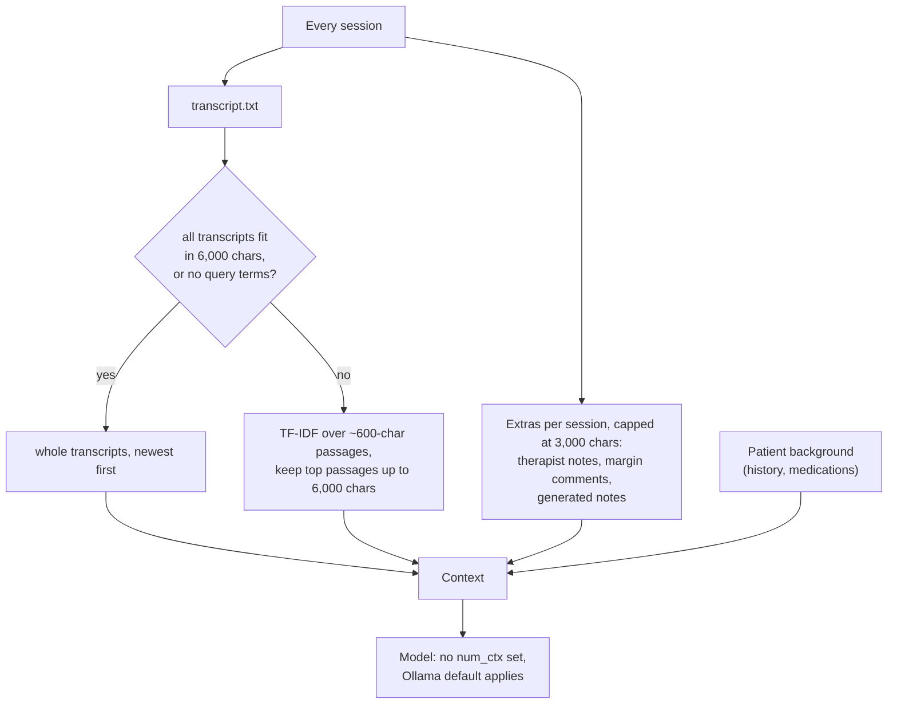
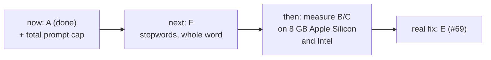
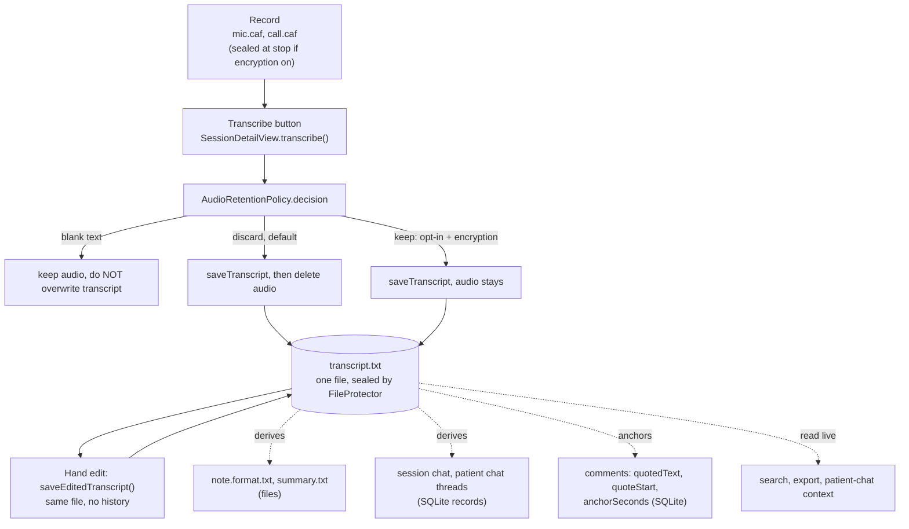
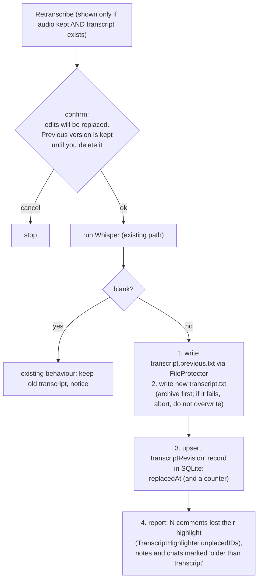

# Design decisions

Open decisions that need an owner call. Each section states what the code does
today (checked against `main`), the options, a recommendation, and what is
needed from the owner.

- [1. Patient-wide chat sees ~6,000 characters of transcript (#164)](#1-patient-wide-chat-transcript-budget-164)
- [2. Retranscribe a session (#175)](#2-retranscribe-a-session-175)

---

## 1. Patient-wide chat transcript budget (#164)

### What the chat sees today

| Part | Limit | Source |
|---|---|---|
| Transcript text, all sessions together | 6,000 chars (about 1,500 tokens) | `PatientContextRetriever.defaultCharacterBudget` |
| Extras per session (notes, comments, generated notes) | 3,000 chars, ordered therapist words first | `Store.patientChatSessionExtrasLimit` |
| Patient background | none | `Patient.aiBackgroundBlock` |
| Total prompt | none (see below) | |
| Model context window | not set by Aletheia | `OllamaClient` sends no `num_ctx` |

An hour of speech is tens of thousands of characters, so a long history is cut
to a small fraction of the transcript text. Ranking is TF-IDF over substring
matches (`TextSearch.queryTerms` keeps every word, no stopword filter), so a
vague question matches weakly and ranks poorly.

**Total prompt size is unbounded.** The 6,000 limit covers transcript text
only. Extras add up to 3,000 chars for each session, so 20 sessions can add
about 60,000 chars (about 15,000 tokens), well above the transcript budget. If
the model's real window is smaller than the prompt, Ollama truncates silently.
The default `num_ctx` depends on the Ollama version and has not been verified
here. Treat this as the first thing to measure (see Decisions needed).

### What changed with this document

Behaviour-preserving transparency only; the budget is unchanged.

- The chat sheet subtitle states the limit instead of claiming it "searches
  every session's transcript".
- After each question, a caption reports about what percentage of transcript
  text was included and how many sessions had no transcript passage included
  (`TranscriptCoverage`, computed in `Store.gatherCitedPatientContext`). It is
  hidden when everything fit. Notes and comments are not counted in it.
- `PatientContextRetriever.defaultCharacterBudget` names the former literal
  `6000` so the UI and docs quote one value.

Citations are already limited to sessions that appear in the context. They can
still include a session whose only material was notes, not transcript text; the
caption covers that gap.

### Options

| Option | Recall | Latency and memory | Risk | Effort |
|---|---|---|---|---|
| **A. Keep 6,000, disclose** (done) | unchanged | none | user still gets partial-evidence answers, now labelled | done |
| **B. Larger fixed budget** (for example 24,000) | up to 4x | KV cache and time-to-first-token grow with prompt; an 8 GB Mac can swap | needs `num_ctx` set to match or Ollama truncates the front of the prompt; changing `num_ctx` reloads the model (cold start) | small, but needs measurement |
| **C. Per-model dynamic budget** | scales with hardware | same as B, bounded by tier | needs a table of context sizes per model tag and per `ModelAdvisor` tier; table goes stale as models change; Ollama's reported window may differ from what fits in RAM | medium |
| **D. Map-reduce summaries** (summarise per session, answer over summaries) | every session represented | one model call per session, slow on 3B models; cache per session keyed on transcript hash to amortise | compounding error; a summary drops the detail a clinician asks about; a wrong "not discussed" is plausible | large |
| **E. Embeddings per #69** (NaturalLanguage, on-device) | best for vague questions | index build once per session; query is cheap | index is PHI: must be sealed (`FileProtector`), migrated by `DataMigrator`, excluded from export and covered by backup rules | large |
| **F. Lexical fixes** (stopwords, whole-word match) | small gain | none | low | small |

### Recommendation

1. Ship A (this change) and add a **total** prompt cap (extras across all
   sessions), so the prompt cannot exceed the window by session count.
2. Do F with it; it is a small, test-covered change in `TextSearch` and the
   retriever.
3. Do B or C only after measuring memory and time-to-first-token on an 8 GB
   Apple Silicon Mac and an Intel Mac. If done, set `num_ctx` explicitly and
   derive the budget from it (C), not a fixed constant (B). Do not raise the
   budget without setting `num_ctx`.
4. Skip D: it is slow on the small models `ModelAdvisor` picks for 8 GB Macs,
   and its failure mode (confident summary that omits the detail) is the one
   the issue is trying to remove.
5. Treat E (#69) as the real fix for vague cross-session questions.

### Decisions needed

1. Is the coverage caption enough, or should a hard "I could not read the full
   record" state block answers?
2. Minimum supported Mac for the chat feature (8 GB Apple Silicon?).
3. Does longer time-to-first-token matter more than recall for your workflow?
4. Approve a total prompt cap (which value) or a measured `num_ctx` first.

---

## 2. Retranscribe a session (#175)

Status: not planned. This records what would break and the smallest safe
design if it is built. No code changes.

### Current data flow

### An existing hazard, independent of this feature

`Transcribe` is enabled whenever `mic.caf` or `call.caf` exists
(`hasAnyRecording`), with no check for an existing transcript and no
confirmation. Whenever audio is retained (opt-in with encryption, or kept
because the first transcript was blank), tapping Transcribe again already
overwrites `transcript.txt` through `saveTranscript` with no history. Hand
edits and any deliberate removal of identifying text are lost silently. A
retranscribe feature would formalise this path, so fix the silent overwrite
first.

### What is keyed to the transcript

| Artifact | Where | How it depends on the transcript | Effect of a replaced transcript |
|---|---|---|---|
| Hand edits and removals | `transcript.txt` | the file itself | lost; Whisper output returns, including text the user removed |
| Comment highlight | SQLite `comment` records (`quotedText`, `quoteStart`) | `TranscriptHighlighter.resolve` re-verifies the quote; falls back to nearest occurrence, or unique match for legacy comments | safe: unmatched comments render unanchored (`unplacedIDs`), none are deleted or mis-anchored. Comment text is kept, the highlight is gone |
| Comment time anchor | `anchorSeconds` | set once from `[MM:SS]` at creation, never recomputed | stale: Whisper timestamps shift between runs or models, so rail ordering and time labels drift |
| Generated notes | `note.<format>.txt`, `summary.txt` | produced from the old text, no revision recorded | stale, indistinguishable from a note on the new text |
| Therapist notes | SQLite `note` record | free text; independent of transcript | unaffected |
| Session chat | SQLite `sessionChat` | answers quote the old transcript | stale answers remain, unlabelled |
| Patient chat threads | SQLite `chatThread` | stored answers already decorated with session dates and a Sources footer (`Citations.decorate`); tags `S1..` are per question, not stable ids | stale text; no pointer into the transcript to break |
| Search, patient-chat context, export | read from files at query time (`searchSessions`, `gatherCitedPatientContext`) | live | not stale. The issue's "search index" does not exist; there is no persisted index |
| Spotlight | names and dates only | none | unaffected |
| Encryption sealing | `FileProtector.write` seals each write | `saveTranscript` seals correctly | a **new** file kind (such as a prior revision) is not covered: `DataMigrator` converts only a fixed list (`transcript.txt`, `summary.txt`, `chat.json`, `note.*.txt`). A revision file left out of that list is skipped on enable (stays plaintext) and, worse, stays sealed when encryption is turned off after the keystore is removed (unreadable) |
| DB snapshots and backups | `.backups/snapshots` cover SQLite only | `transcript.txt` is a file | a replaced transcript is not recoverable from DB snapshots; only Time Machine or a manual copy |
| Whisper model | `WhisperModel` pinned by SHA | a different model gives different text and timing | every item above changes more, not less |
| Audio retention | `AudioRetentionPolicy` | audio is deleted after the first non-blank transcript by default | in the default case there is nothing to retranscribe |

### Constraints that shape any design

- **Redaction vs. history.** If a user removed identifying text by hand, a
  stored prior revision keeps that text. It must be sealed, visible in the UI,
  and deletable on demand. Retained audio already holds the spoken original, so
  hand edits are not a security redaction while audio is kept; the UI should
  not imply otherwise.
- **PHI never leaves the Mac**; revisions are extra PHI on disk and must follow
  the same sealing, migration, export and deletion rules as `transcript.txt`.
- **No `.xcodeproj` or schema churn**: SQLite `records` is generic
  `(kind, id, owner, item, payload)`; a new record kind needs no migration.

### Options, best first

| # | Option | Safety | Cost | Notes |
|---|---|---|---|---|
| 1 | **Do not build; guard the existing overwrite** | highest | tiny | confirm before Transcribe replaces a non-empty transcript; no history |
| 2 | **Single previous revision + confirm + stale markers** (recommended if built) | high | small to medium | one sealed `transcript.previous.txt`, replaced each time |
| 3 | Numbered revisions with restore and diff | high | medium to large | retention growth, delete UI, more `DataMigrator` surface, export rules |
| 4 | Retranscribe into an alternate transcript, user picks per passage | highest fidelity | large | merge UI; comments need a choice of anchor transcript |
| 5 | Silent overwrite (status quo with retained audio) | lowest | none | reject |

### Recommended minimal safe design

Steps and constraints:

1. **Gate the button.** Label it Retranscribe, enabled only when audio exists
   and a transcript exists; a first Transcribe stays as it is.
2. **Archive before replacing.** Write `transcript.previous.txt` through
   `FileProtector` first; abort without touching `transcript.txt` if that
   write fails. Single slot: a second retranscribe replaces the previous slot,
   and the confirm dialog says so when a slot already exists.
3. **Confirm with specifics.** Say that hand edits (and any removed text) will
   come back from the audio, and where the previous version is kept.
4. **Cover the new file kind.** Add `transcript.previous.txt` to
   `DataMigrator.sessionFileNames`, with a test that enable and disable both
   convert it. Exclude it from `MarkdownExporter`, search and chat context. Add
   a "Delete previous version" action; deleting the session folder already
   removes it.
5. **Comments.** Do not delete or edit them. Re-match through the existing
   `TranscriptHighlighter`, count unplaced ones with `unplacedIDs`, and show
   "N comments no longer match the new text". Recomputing `anchorSeconds` for
   re-matched comments needs a repository update method that does not exist
   (`AnnotationRepository` edits body only); leave it out of the first cut and
   say time labels may be off.
6. **Staleness without a schema.** Store one `transcriptRevision` record per
   session (`replacedAt`). A generated note is "older than the transcript"
   when its file modification date precedes `replacedAt`; chat messages carry
   `ChatMessage.date` and compare directly. Show a one-line badge on the note
   and in chat; do not rewrite or delete them.
7. **Audit.** Optional: add an `AuditEvent` case for "transcript replaced".
8. **Tests** (XCTest, run in CI): archive-then-write ordering and failure
   abort; blank result leaves transcript untouched; migrator round trip for the
   new file; comment re-match count; staleness comparison as a pure function.

Not recommended: an automatic retranscribe on model change, bulk retranscribe,
and any path that overwrites without the previous-version write succeeding.

### Decisions needed

1. Build retranscribe at all, or ship only option 1 (confirm before
   overwrite)? Option 1 is recommended now either way.
2. Accept keeping one previous revision as extra sealed PHI, with an explicit
   delete action? The alternative, no history, repeats the silent loss.
3. Accept that `anchorSeconds` may be stale after a retranscribe in the first
   cut?
