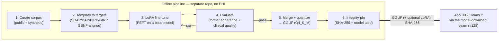

# Fine-tuning pipeline: plan & skeleton

A plan for producing the fine-tuned, quantized GGUF (and optional LoRA adapters)
the app's embedded llama.cpp backend loads. It is an **engineering design
reference**, not a shipped subsystem: the pipeline runs **offline, in a separate
repository**, and never touches the app's runtime or a clinician's Mac. The app
consumes only its *output* — a weights file with an integrity hash — through the
model-download seam.

Tracked as #129 under the on-device LLM epic (#121). It does **not gate** the
app: the MVP ships with stock `ggml-org` GGUF weights; a fine-tuned model is a
drop-in improvement that lands later via #125 (GGUF + LoRA loading).

---

## Non-negotiable: no PHI, ever

The single hard rule that shapes every stage:

> **No patient-derived data enters this pipeline at any point.** Not as training
> data, not as evaluation data, not as a prompt to a frontier model. The pipeline
> runs on a developer machine / CI, never on a clinician's Mac, and has no access
> to any real session.

Why this is safe to state absolutely:

- **Training inputs are public or synthetic.** The corpus is a licensed public
  dataset ([MentalChat16K](https://huggingface.co/datasets/ShenLab/MentalChat16K)
  and similar) plus **synthetic** instruction/response pairs generated by a
  frontier model from *fabricated* vignettes we author. The frontier-model API is
  the one place data leaves a machine, and it only ever sees synthetic text we
  wrote — never a real transcript, note, or patient detail.
- **Outputs are weights, not records.** A fine-tuned model file is derived
  statistical parameters, not PHI. Shipping it to users is compatible with "PHI
  never leaves the Mac" for the same reason shipping the stock model is: no
  patient data is in it.
- **The clinician's data stays put.** Personalization on real sessions, if ever
  offered, would be a *separate* on-device-only story (local LoRA training on the
  Mac, weights never uploaded) and is explicitly out of scope here.

This mirrors the app's own invariant (`docs/HIPAA-SAFEGUARDS.md`,
`docs/DATA-SAFETY.md`): the boundary is drawn so the guarantee is structural, not
a policy someone has to remember.

---

## What the pipeline produces



The hand-off is a **file plus a hash plus a model card** — nothing executable, no
service. That keeps the trust boundary at the app's existing integrity check
(`LlamaModel.expectedSHA256`, verified by `LlamaModelDownloader`).

---

## Stages

Each stage names its inputs, outputs, tooling, and the script stub that will
implement it in the separate repo.

### 1. Curate corpus — `scripts/01_curate.py`
- **In:** public datasets (MentalChat16K et al.); author-written synthetic
  vignettes; a frontier-model API key (synthetic generation only).
- **Out:** a normalized JSONL of `{instruction, input, output}` rows, deduped,
  license-tagged, PHI-scanned (belt-and-braces: assert no real-PII patterns even
  though inputs are synthetic).
- **Tooling:** `datasets`, a PHI/PII linter reusing the spirit of
  `scripts/scan-secrets.sh`.

### 2. Template to targets — `scripts/02_template.py`
- **In:** the curated JSONL.
- **Out:** training rows whose *outputs* are shaped exactly like the app's note
  formats — the same `## Heading` sections `ProgressNoteFormat` defines — so the
  model learns the structure the app's **GBNF grammar** (see
  `Sources/App/Services/Llama/NoteFormatGrammar.swift`, #123) constrains at
  decode time. Training shape and decode grammar must agree; this stage is where
  they're kept in sync (ideally by importing the heading list from a shared spec).
- **Covers:** SOAP, DAP, BIRP, GIRP.

### 3. LoRA fine-tune — `scripts/03_finetune.py`
- **In:** templated rows; a base model (candidate: the same Llama 3.2 1B/3B
  Instruct family the app already downloads, so the runtime and tokenizer match).
- **Out:** a LoRA adapter (PEFT), plus training logs/metrics.
- **Tooling:** `transformers` + `peft` + `trl`; QLoRA for consumer GPUs.
- **Why LoRA:** small, swappable adapters (#125's "swappable LoRA" goal), cheap to
  retrain, and mergeable into the base for a single shipped GGUF.

### 4. Evaluate — `scripts/04_eval.py`
- **In:** the adapter + a held-out synthetic eval set.
- **Out:** a scorecard gating promotion. Two axes:
  - **Format adherence** — does the raw output satisfy the note's GBNF grammar
    (parse it with the same grammar the app uses)? This is objective and must be
    ~100% before quantization, since the app relies on it.
  - **Clinical quality** — groundedness (no invented facts), safety-flagging, and
    concision, judged on synthetic transcripts (rubric + frontier-model-as-judge
    on synthetic data only).
- Fails loop back to stage 3.

### 5. Merge + quantize → GGUF — `scripts/05_quantize.py`
- **In:** base model + passing adapter.
- **Out:** a `Q4_K_M` GGUF (matching the app's current quantization), and
  optionally the standalone LoRA for hot-swap.
- **Tooling:** `llama.cpp`'s `convert_hf_to_gguf.py` + `llama-quantize`, pinned to
  the **same llama.cpp revision the app links** (`b11149` today — see
  `project.yml`) so runtime and conversion never skew.

### 6. Integrity-pin — `scripts/06_release.py`
- **In:** the GGUF (+ LoRA).
- **Out:** SHA-256 of each artifact, a **model card** (base, data provenance,
  eval scorecard, license, intended use + limitations), and the copy-paste values
  for the app: `LlamaModel.expectedSHA256` and the download URL.
- The app never trusts a weight without this hash.

---

## Separate-repo layout (skeleton)

```
aletheia-finetune/                 # separate repo; NOT this app repo
├── README.md                      # this plan, operationalized
├── data/
│   ├── synthetic/                 # author-written vignettes (no PHI, by construction)
│   └── .gitignore                 # never commit large/derived corpora
├── scripts/
│   ├── 01_curate.py
│   ├── 02_template.py             # imports the note-format heading spec
│   ├── 03_finetune.py
│   ├── 04_eval.py                 # parses output with the app's GBNF grammar
│   ├── 05_quantize.py             # pinned to the app's llama.cpp revision
│   └── 06_release.py              # emits SHA-256 + model card
├── configs/                       # LoRA/QLoRA hyperparameters, per base model
└── model_cards/                   # one per released artifact
```

Kept out of the app repo on purpose: heavy Python/ML deps, GPU tooling, and large
data have no place in a lean, auditable Swift app whose supply chain is a hard
constraint.

---

## Hand-off contract to the app (#125)

The pipeline delivers, and #125 consumes, exactly:

| Artifact | Purpose | App-side check |
|---|---|---|
| `*.gguf` (Q4_K_M) | the model weights | SHA-256 == `LlamaModel.expectedSHA256` |
| `*.lora.gguf` (optional) | swappable adapter | SHA-256 pin; base-model compatibility asserted, else fail closed |
| model card (md) | provenance + eval + limits | human review before pinning |

A mismatched adapter or hash **fails closed** with a clear error (the behavior
#125's acceptance criterion already calls for) — the app never loads an
unverified or incompatible model.

---

## Open decisions (defer to the owner)

- **Base model:** stay on Llama 3.2 (1B/3B) for runtime/tokenizer parity, or
  evaluate a small clinical-domain base? (Licensing + on-device size are the
  constraints.)
- **Ship shape:** a single merged GGUF (simplest) vs. base + swappable LoRA
  (smaller updates, per-format adapters). #125 supports both; the pipeline can
  emit either.
- **Frontier model for synthetic generation:** which provider/model, and the
  synthetic-data prompt library — the only external dependency, and the only
  place to re-affirm "synthetic only."
- **Eval bar:** the exact format-adherence and quality thresholds that gate
  stage 4 → 5.
