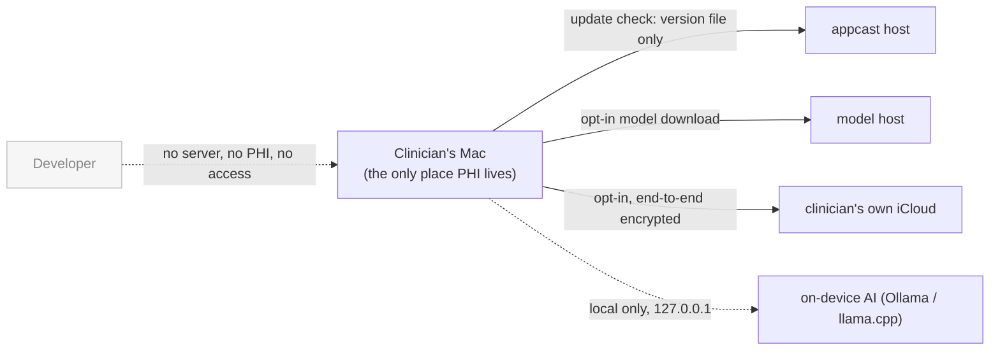

# HIPAA safeguards mapping

How Aletheia's design and features map to the HIPAA Security Rule
(45 CFR §164.308–312). This is an engineering reference, **not legal advice** and
not a certification. HIPAA compliance is a property of a *practice* — its
policies, agreements, and workforce — not of any single application. Aletheia is
built to make the technical part straightforward and to stay out of the way of
the administrative part. Have your own counsel and your licensure/state
record-keeping rules reviewed before relying on any of this.

## Why the compliance surface is small

Aletheia is a **single-user, on-device** application. PHI (session audio,
transcripts, summaries, notes, comments) is created and stored only in a data
folder the clinician chooses on their own Mac. The developer runs **no servers,
accounts, analytics, or telemetry** and never receives, transmits, stores, or can
access any of that data.

Because the developer never receives PHI, the developer is **not a business
associate** for the app itself, and no Business Associate Agreement (BAA) is
required for the app (see [PRIVACY.md](../PRIVACY.md)). The clinician/practice is
the covered entity and data controller. That shifts most of HIPAA onto
administrative and physical safeguards the practice owns; the app's job is the
**technical safeguards** below, plus making the practice's documentation easy.

## Technical safeguards — §164.312

Legend: **✅ in place** · **◐ in progress** · **○ clinician responsibility (app assists)**

| Safeguard (§164.312) | Status | How Aletheia addresses it |
| --- | --- | --- |
| **Access control (a)(1)** — unique user ID, limit access to authorized users | ✅ / ○ | Single-user app scoped to one macOS account. The macOS login (unique user, password/Touch ID) is the access boundary; the app adds its own lock below. |
| **Automatic logoff (a)(2)(iii)** *(addressable)* | ◐ | App lock re-engages when the app is hidden; a configurable **idle auto-lock timeout** re-locks after inactivity. |
| **Encryption & decryption (a)(2)(iv)** *(addressable)* | ✅ / ◐ | Opt-in AES-256-GCM at rest for the database, transcripts, summaries, and audio (see [ENCRYPTION.md](ENCRYPTION.md)); FileVault recommended as the disk-level baseline; making encryption the default is in progress. |
| **Audit controls (b)** — record and examine activity involving ePHI | ✅ / ◐ | An on-device, append-only audit log (`audit.log`, one JSON line per event) records ePHI-affecting actions with timestamps and holds **no names or clinical content** — only action types and opaque record ids. It's viewable and exportable in Settings, stored only on the Mac. App-unlock and encryption enable/disable/unlock are wired now; export/delete/backup events attach as those flows land. |
| **Integrity (c)(1)** — protect ePHI from improper alteration/destruction | ✅ / ○ | SQLite `PRAGMA secure_delete` zeroes freed pages; atomic writes for identity/metadata; encrypted backups are sealed snapshots. Source-of-truth transcript is editable by the clinician by design (right-to-amend), with edits under the clinician's control. |
| **Person/entity authentication (d)** | ✅ | App lock via `LocalAuthentication` (Touch ID or Mac password) gates access to the app; macOS account auth gates the device. |
| **Transmission security (e)(1)** — guard ePHI in transit | ✅ | PHI is not transmitted. The only outbound connections carry no PHI (update check, opt-in model downloads) or are local (`127.0.0.1` on-device AI). Optional iCloud backup is **end-to-end encrypted on-device before upload**, so only ciphertext leaves the Mac. |

## Administrative & physical safeguards — §164.308 / §164.310

These belong to the practice. Aletheia supports, but cannot satisfy, them:

- **Risk analysis & management (§164.308(a)(1))** — this document plus the app's
  visible safeguard state help you document the technical controls in your risk
  analysis. The policy/analysis itself is yours.
- **Workforce security, sanction policy, information-access management** — org
  policy. On a shared Mac, use separate macOS accounts and enable app lock +
  idle auto-lock.
- **Contingency plan / data backup (§164.308(a)(7))** — Time Machine backs up the
  data folder locally; an opt-in encrypted snapshot (optionally to the
  clinician's own iCloud) supports off-device recovery. Test your restores.
- **Facility & workstation/device controls (§164.310)** — physical security of
  the Mac is the practice's. FileVault + app lock reduce exposure if a device is
  lost or left unattended.
- **Media disposal (§164.310(d))** — the app's secure-delete and at-rest
  encryption support defensible disposal of ePHI on the device.

## Retention note

Aletheia does **not** auto-delete clinical records on a timer. US clinical-record
retention is governed by state law and licensure boards (commonly several years
for adults, and for minors often *age of majority + N years*), not by HIPAA, and
deleting **too early** is the more common compliance risk. Retention and disposal
timing is a clinical/legal decision the clinician makes for their jurisdiction;
the app keeps records until the clinician removes them.

## Where these controls live in the app

- Settings › Security — app lock, idle auto-lock, FileVault guidance.
- Settings › Extra Encryption — at-rest encryption (Tier 2) and recovery
  passphrase; see [ENCRYPTION.md](ENCRYPTION.md).
- Settings › Backup — Time Machine guidance and opt-in encrypted snapshot.
- Settings › Legal — locally recorded acceptance of the current Terms/Privacy.

See also [SECURITY.md](../SECURITY.md) for the threat model and the
secret/PHI leak gates that keep the repository clean.
